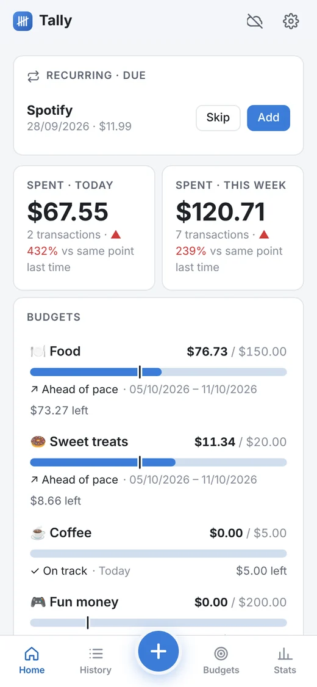
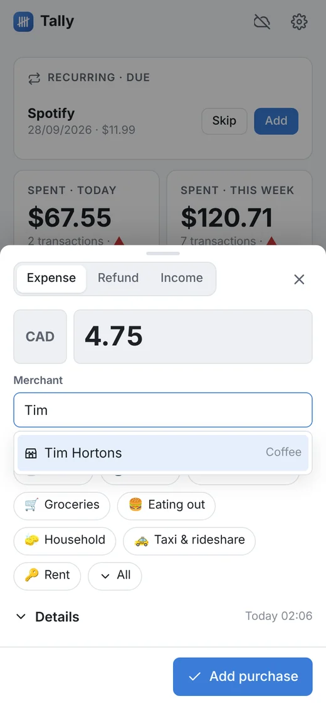
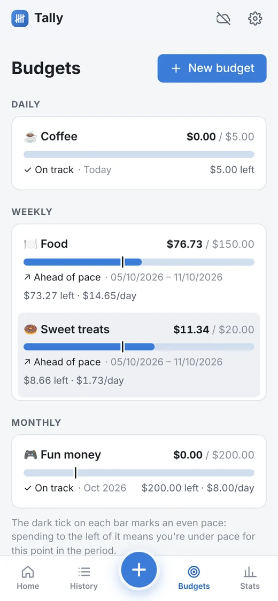
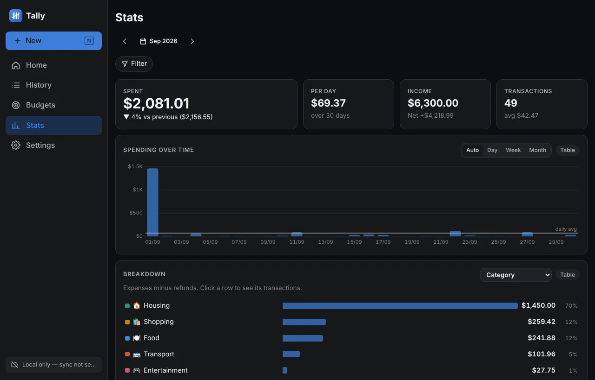

# Tally

**Fast, private, local-first budgeting** for Linux, Android and the web.
Log a purchase in a few seconds, set budgets that keep you honest, and see where
your money goes. Your data lives on your devices and syncs through a small
server you run yourself (e.g. a Raspberry Pi on Tailscale).

<p>
  
  
  
</p>


## Highlights

* **Quick entry:** amount → merchant (autocomplete) → save. Each merchant
  remembers its category, payment method, online/in-person and currency.
  Optional details: item name, date/time, tags, description, purpose, **split
  across categories**, other currencies, **receipt photos/PDFs**. Undo after
  saving.
* **Budgets that matter while you shop:** daily/weekly/monthly/yearly (or every
  N), on any mix of categories, tags, merchants and payment methods; overlapping
  is fine (Food *and* Sweet treats). After every purchase you see what's left;
  bars show an even-pace marker.
* **Analysis:** spending by day with daily totals, sortable table, search and
  filters; stats with period comparison, breakdown by any dimension with
  drill-down, pace vs last period, calendar heatmap.
* **Your dashboard, your way:** add, remove, resize, reorder and configure
  widgets; minimal by default.
* **Pretty and customisable:** 8 styles, any accent colour generates a full
  light/dark theme with guaranteed contrast, fonts, roundness, density,
  per-colour fine-tuning, save/export your own styles.
* **Works on bad connections and slow phones:** everything saves locally
  first; sync happens in the background with a visible "not synced yet"
  indicator; 51 KB initial download; offline after first load.
* **Receipts:** snap a photo (or attach a PDF) on any purchase; shrunk for fast
  sync, encrypted with the rest of your data, included in backups.
* **Sync & backups:** self-hosted, zero-dependency Node server (Docker image or
  systemd); optional
  end-to-end encryption; daily rotating snapshots you can point at
  Syncthing/Nextcloud; restore from the app.
* **Your data, reusable:** documented JSON format; export JSON / CSV / SQLite;
  import bank CSVs (CIBC detected automatically, duplicates and already-logged
  purchases skipped).
* **Extensible:** typed events, a widget registry, a style registry and
  on/off modules — groundwork for things like gamification.

## Get it running

1. **Server** (Raspberry Pi or any Linux box) — [docs/self-hosting.md](docs/self-hosting.md).
   With Docker, a compose file with `image: ghcr.io/lukajakimovski/tally-server:latest`
   and `docker compose up -d` is all it takes (a systemd install is documented too). Then:
   ```bash
   sudo tailscale serve --bg --https=443 http://127.0.0.1:8787
   ```
   Open `https://<pi>.<tailnet>.ts.net` — that's also the web app.
2. **Linux (CachyOS/Arch):** `cd packaging/arch && makepkg -si` — [docs/building.md](docs/building.md)
3. **Android:** grab the APK from the *Release* workflow (or build it) — [docs/building.md](docs/building.md#android)
4. In the app: *Settings → Sync & devices*, create a vault on one device and
   join it on the others.

You can also use it with no server at all — it works fully on one device (with
backup reminders).

## Documentation

| | |
|---|---|
| [User guide](docs/user-guide.md) | Everything the app does and how to use it |
| [Self-hosting](docs/self-hosting.md) | Sync server on a Pi with Tailscale, Docker, backups, config |
| [Building](docs/building.md) | Web, Linux/Arch, Android (signing), releases, CI |
| [Architecture](docs/architecture.md) | How it works inside |
| [Data format](docs/data-format.md) | The JSON documents, exports, and reading them from code |
| [Sync protocol](docs/sync-protocol.md) | Revisions, conflict handling, encryption, HTTP API |
| [Theming](docs/theming.md) | Tokens, the palette generator, adding styles |
| [Extending](docs/extending.md) | Events, widgets, styles and modules |
| [Security](docs/security.md) | Where data goes, encryption, PIN, hardening |

## Repository

```
app/        web app (Svelte 5 + TypeScript); Android project in app/android
desktop/    Linux app (Tauri 2)
server/     sync + backup server (Node.js, no dependencies)
packaging/  Arch PKGBUILDs, desktop entry
tools/      scripts for exported data
docs/       documentation
```

## Development

```bash
cd app && npm ci
npm run dev        # http://localhost:5173
npm run check      # type-check
npm test           # unit tests
npm run build && npm run test:e2e   # end-to-end tests (Playwright)
cd ../server && npm test
```

## License

MIT — see [LICENSE](LICENSE).
